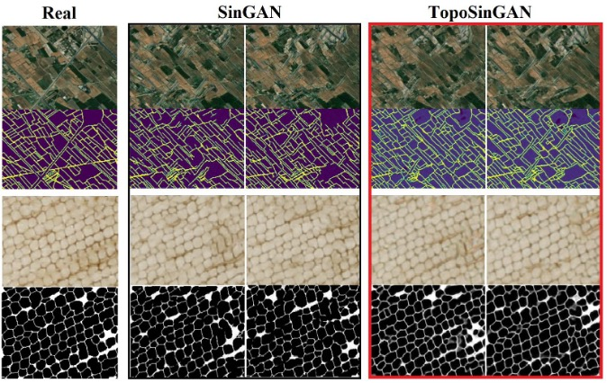

# TopoSinGAN
## Learning a Topology-Aware Generative Model from a Single Image



## Instructions:

Navigate to the root folder of the repository and run the following command:

### Using CUDA:

```bash
python -u toposingan/main_train.py --input_name agricultural_fields.png --nc_z 4 --nc_im 4 --gpu_id 0
```

### Using CPUs:

```bash
python -u toposingan/main_train.py --input_name agricultural_fields.png --nc_z 4 --nc_im 4 --not_cuda
```

## Node Topology Clustering (NTC) Evaluation Metric

[GitHub Repository for NTC Evaluation Metric](https://github.com/mohsenumn/NTC)

### References:

```
@inproceedings{shaham2019singan,
  title={Singan: Learning a generative model from a single natural image},
  author={Shaham, Tamar Rott and Dekel, Tali and Michaeli, Tomer},
  booktitle={Proceedings of the IEEE/CVF International Conference on Computer Vision},
  pages={4570--4580},
  year={2019}
}
```

## Contacts:

### <ahmad178@umn.edu> or <eshook@umn.edu>
